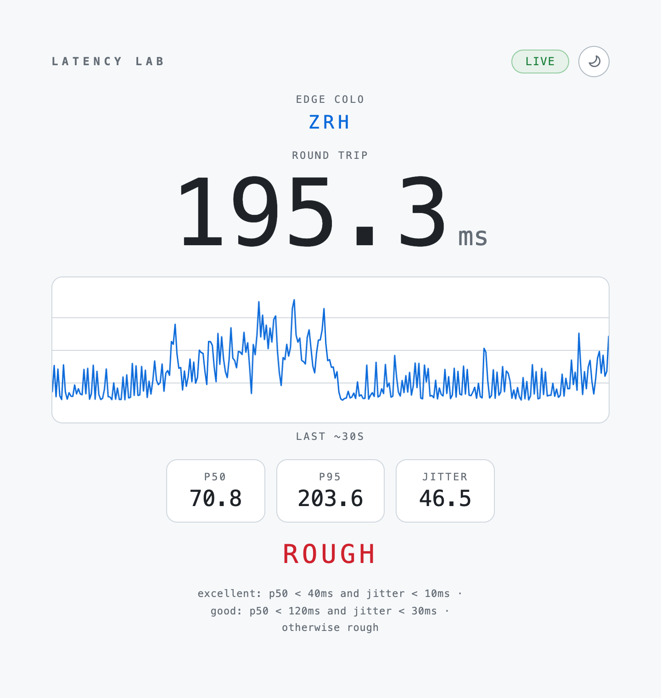

# Latency Lab

See how fast and steady your internet connection is right now, live in a browser tab.



<sub>A real capture from one connection. Your numbers and data center will differ.</sub>

**Try it**: https://latency-lab.simons.workers.dev

Open the page and it starts measuring immediately. You don't need an account or an install, and there is nothing to configure.

## What it does

- **Measures continuously.** It pings the nearest Cloudflare data center ten times per second and redraws the last 30 seconds as a live graph, so you can see spikes happen as they occur.
- **Turns the numbers into a verdict.** It shows the typical round trip (p50), the worst case (p95) and the jitter, then rates the connection as excellent, good or rough.
- **Handles dropped connections.** If the connection drops, the page retries automatically and carries on with the same graph. It stops sending pings while the tab is hidden and picks up again when you return.

## When would I use this?

- Your video calls feel laggy and you want proof before blaming the router
- You want to compare WiFi against your phone's hotspot. Open the page on both devices
- You switched on a VPN or changed a setting and want to know what it did to your latency
- You're just curious how good your connection actually is

## Reading the page

- **Edge colo**: the airport-style code of the Cloudflare data center answering you, for example `ZRH` for Zurich
- **Round trip**: the most recent ping, in milliseconds
- **p50**: the typical ping. Half of the recent pings were faster than this
- **p95**: the worst case. 19 out of 20 pings were faster. Spikes here are what make calls stutter
- **Jitter**: the average change from one ping to the next. Low jitter means smooth video calls and gaming
- **Status pill**: `connecting`, `live` or `reconnecting`

The rating uses p50 and jitter:

| Rating | Meaning |
| --- | --- |
| Excellent | Typical ping under 40 ms and jitter under 10 ms |
| Good | Typical ping under 120 ms and jitter under 30 ms |
| Rough | Anything slower or wobblier than that |

A healthy wired home connection usually meets the Excellent thresholds.

The moon/sun button switches between light and dark themes. By default the page follows your system setting.

## How it works

```
browser tab ──(WebSocket, every 100 ms)──▶ nearest Cloudflare data center
     ▲                                          │
     └──────────── same message echoed back ◀───┘
```

The whole app is one Cloudflare Worker (`src/index.ts`) that does two things:

- `GET /` serves the page (`src/page.ts`), a single HTML file with no build step.
- `GET /ws` opens a WebSocket, sends one hello message naming the data center, then echoes every message back unchanged.

The page stamps each message with the time it was sent and measures how long it takes to come back. Cloudflare routes each visitor to its closest data center, so the result reflects your distance to the edge of the internet rather than to a single fixed test server.

All timing and statistics run in the browser. The Worker has no storage and keeps no state between messages. It forgets you as soon as the socket closes. The only thing the page saves is your theme choice, which stays in your browser's local storage.

The statistics live in `src/measurement/index.ts` as pure, unit-tested functions. Because the page has no build step, it carries an inline copy of the same math. If you change one, change the other.

## Running it yourself

Prerequisites: Node.js 22 or newer (required by Wrangler).

```bash
npm install
npm run dev        # local copy at http://localhost:8787
npm test           # unit tests for the statistics and rating
npm run typecheck  # TypeScript check, no output on success
```

To deploy your own copy to Cloudflare Workers (the free plan is enough), log in with `npx wrangler login`, then run:

```bash
npx wrangler deploy
```

This project needs no bindings, secrets or environment variables. See `wrangler.jsonc` for the settings.

## Limitations

- It measures latency and jitter only. It does not measure download or upload speed, and it does not detect packet loss.
- The round trip includes browser and WebSocket overhead, so it will read a few milliseconds higher than a command-line `ping`.
- It measures the path to Cloudflare's nearest data center. Latency to a specific game server or video service may be different.
- Pings pause while the tab is hidden, so leave it in the foreground for a continuous reading.
- The rating thresholds are fixed rules of thumb and are not configurable.

## Further documentation

- `.scratch/latency-lab/`: the original spec and implementation tickets
- `docs/agents/`: notes for coding agents working in this repo
